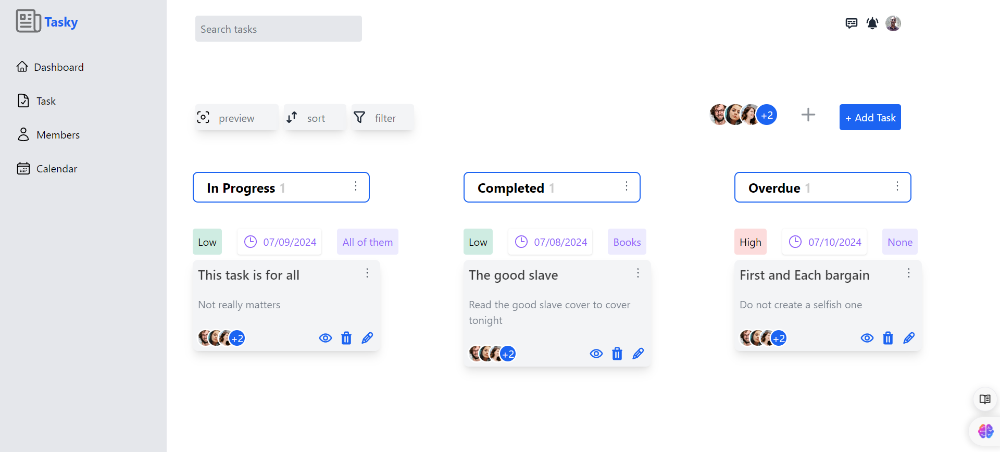

# Task Creation App



The Task Creation App allows users to create tasks, assign them to users, and mark tasks as completed. The app is built with Django and Django REST Framework.

## Table of Contents

1. [Getting Started](#getting-started)
2. [Installation](#installation)
3. [Usage](#usage)
4. [Testing](#testing)
5. [API Documentation](#api-documentation)
6. [Contributing](#contributing)
7. [License](#license)

## Getting Started

To get started with the Task Creation App, follow the instructions below to set up the project locally.

## Installation

### Prerequisites

- Python 3.x
- Node.js and npm
- PostgreSQL or MySQL (optional, if you prefer not to use SQLite)

### Steps

1. **Clone the repository:**

    ```bash
    git clone https://github.com/ezeisraeljohn/task_creation.git
    cd task_creation
    ```

2. **Set up a virtual environment:**

    ```bash
    python -m venv .venv
    source .venv/bin/activate  # On Windows use `.venv\Scripts\activate`
    ```

3. **Install the dependencies:**

    ```bash
    pip install -r requirements.txt
    ```

4. **Install Node.js dependencies:**

    ```bash
    npm install
    ```

5. **Build Tailwind CSS:**

    Ensure you have npx installed (it comes with npm). Then run:

    ```bash
    npx tailwindcss build src/styles.css -o static/css/styles.css
    ```

6. **Configure the database:**

    Ensure you have a PostgreSQL or MySQL database set up. Update the database settings in the `task_creation/settings.py` file.

    ```python
    DATABASES = {
        'default': {
            'ENGINE': 'django.db.backends.postgresql',
            'NAME': 'dbname',
            'USER': 'username',
            'PASSWORD': 'password',
            'HOST': 'localhost',
            'PORT': '5432',
        }
    }
    ```

    If none is available, you can still use the default SQLite database.

    ```python
    DATABASES = {
        'default': {
            'ENGINE': 'django.db.backends.sqlite3',
            'NAME': BASE_DIR / 'db.sqlite3',
        }
    }
    ```

7. **Apply the migrations:**

    ```bash
    python manage.py makemigrations
    python manage.py migrate
    ```

    create a superuser(if you want to access the admin page)
    ```bash
        python manage.py createsuperuser
    ```
    and follow the prompts to create a superuser.

8. **Run the server:**

    ```bash
    python manage.py runserver
    ```

## Usage

Once the server is running, you can interact with the application's dashboard using the link [http://127.0.0.1:8000/dashboard/](http://127.0.0.1:8000/dashboard/)

## Testing

To run the tests, use the following command:

```bash
python manage.py test
